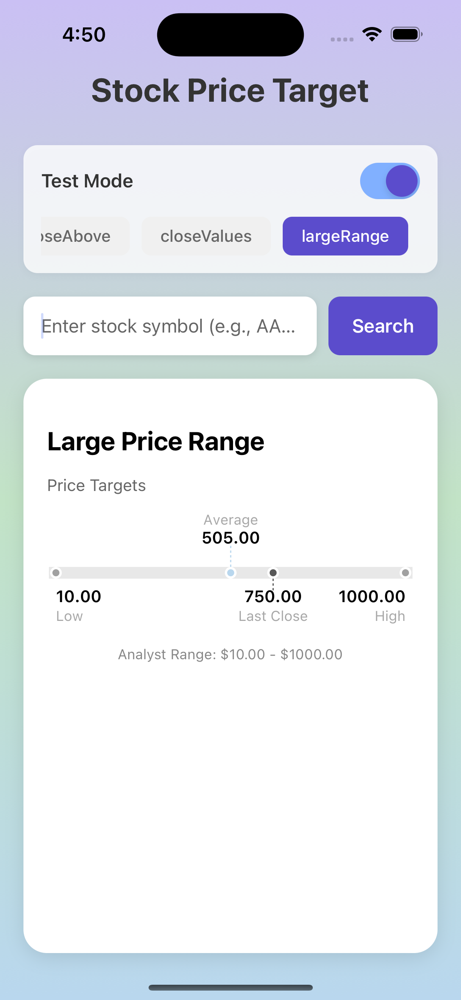

# Stock Price Target Visualization Component

A self-contained React Native component for visualizing stock price targets with an intuitive horizontal chart. This project includes a reusable chart component, styling system, and a demo app showcasing the implementation.

## 📱 Demo Screenshots




The component displays analyst price targets (low, mean, high) alongside the current stock price in a clean, horizontal chart format.

## 🚀 Getting Started

### Prerequisites

- Node.js (v14 or higher)
- npm
- Expo CLI (`npm install -g expo-cli`)
- iOS Simulator (Mac) or Android Emulator

### Installation

1. Clone the repository:

```bash
git clone https://github.com/jiunshinn/TickUp.git
cd TickUp
```

2. Install dependencies:

```bash
npm install
```

3. Set up environment variables:

```bash
# Create .env file from the example
cp .env.example .env

# Edit .env and replace BASE_URL with the actual API URL


```

4. Start the Expo development server:

```bash
npm start
```

5. Run on your preferred platform:

- Press `i` for iOS simulator
- Press `a` for Android emulator
- Scan QR code with Expo Go app for physical device

## 📁 Project Structure

```
TickUp/
├── app/                                  # Main application screens
│   └── index.tsx                        # Demo app with search interface
├── components/                          # React components
│   ├── PriceTargetChart.tsx           # Original modular chart component
├── services/                            # API services
│   └── api.ts                          # API client for fetching price data
├── types/                               # TypeScript type definitions
│   ├── api.types.ts                    # API response types
│   └── chart.types.ts                  # Chart-specific types
├── utils/                               # Utility functions
│   └── chartLogic.ts                   # Chart calculation logic
└── package.json                         # Project dependencies
```

## 🎨 Design Decisions & Tradeoffs

### Assumptions

1. **Screen Size**: Designed for mobile devices with responsive width calculation
2. **Data Validity**: Assumes API returns valid numeric values for all price fields
3. **Color Consistency**: Uses a consistent blue (#3478F6) for analyst targets and gray (#555555) for last close
4. **Label Positioning**: Implements collision detection to prevent overlapping labels

### Design Tradeoffs

1. **SVG vs Native Views**:

   - Chose SVG for precise control over chart rendering
   - Trade-off: Slightly more complex but provides better visual accuracy

2. **Label Collision Algorithm**:

   - Simple alternating y-level approach
   - Works well for typical price ranges but may need enhancement for extreme cases

3. **Fixed Chart Dimensions**:
   - Uses device width minus padding for consistency
   - Could be made more configurable for different layouts

### Technical Decisions

1. **D3 Scale Functions**: Used only `scaleLinear` from D3 for efficient price-to-pixel mapping
2. **TypeScript**: Full type safety for better developer experience
3. **Inline Styles**: Kept styles close to components for easier maintenance

## 🚧 Future Improvements

### Feature Enhancements

1. **Animations**:

   - Smooth transitions when data updates
   - Entry animations for markers and labels

2. **Interactivity**:

   - Tap on markers to show detailed information
   - Pinch-to-zoom for price range exploration

3. **Additional Data Points**:

   - Support for multiple analyst firms
   - Historical price target trends
   - Confidence intervals

4. **Customization**:
   - Configurable color themes
   - Adjustable chart dimensions
   - Custom marker shapes

### Technical Improvements

1. **Performance**:

   - Memoization of expensive calculations
   - Virtual rendering for multiple charts

2. **Testing**:

   - Comprehensive unit tests for chart logic
   - Visual regression tests

## 🧪 Running Tests

```bash
# Run tests in watch mode
npm test

```
